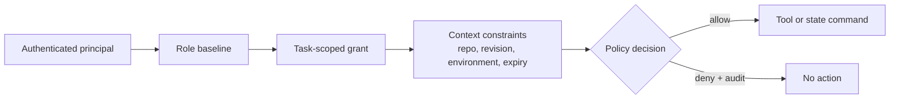

# Agent Identity and Security Model

## Security posture

Every agent, worker, provider callback, and human is a principal. Model-generated text is untrusted input, including when it claims to be an approval, test result, administrator instruction, or policy exception. Authorization is evaluated outside the model runtime.

The MVP uses capability-based RBAC: roles provide a baseline set of capabilities, while each assignment narrows them to a workflow, task, repository, revision, filesystem scope, tool set, network policy, resource budget, and expiration. A request is allowed only when both the role and active grant permit it.

## Principal types

- **Human:** authenticated operator, reviewer, approver, or auditor. Human status must come from the identity system, not a request field.
- **Agent:** a logical service identity assigned one role and task at a time. The agent identity is distinct from the underlying model/provider.
- **Worker:** a platform service identity authorized to lease tasks and invoke narrowly scoped runtime operations.
- **Integration:** Git, CI, or provider callback identity with signature verification and minimal callback permission.

The system records both logical agent identity and provider/model metadata. Changing a model does not silently change the identity's grant.

## Roles and capabilities

| Role | Typical allowed capabilities | Explicitly denied |
|---|---|---|
| `ARCHITECT` | Read approved requirements; create plan/decision artifacts; propose tasks | Modify repository; approve plan, merge, or deploy |
| `REVIEWER` | Read proposal and selected evidence; create independent findings and dispositions | Modify reviewed artifact; approve own work; weaken policy |
| `IMPLEMENTER` | Read assigned paths; edit assigned worktree; run allowlisted development commands; submit change artifact | Merge; deploy; approve; access production; modify out-of-scope paths |
| `TEST_AGENT` | Read candidate revision; run test tools; publish signed/hashed test evidence | Edit candidate revision; mark policy pass without evidence |
| `SECURITY_AGENT` | Read candidate and manifests; run approved scanners; publish findings | Change security policy/baseline; suppress findings; approve exceptions |
| `DOCUMENTATION_AGENT` | Update assigned documentation paths after approved technical changes | Alter application/security code unless separately assigned |
| `ORCHESTRATOR` | Create/assign tasks through policy; evaluate predicates; request transitions; cancel/retry within policy | Direct repository edits; create human approvals; bypass required states |
| `HUMAN_APPROVER` | Approve/reject specifically authorized action scopes; disposition contained input | Grant approval outside owned repository/environment or after expiry; bypass provider qualification |
| `AUDITOR` | Read audit metadata/evidence permitted by classification | Change workflow state or evidence |
| `IDE_INTEGRATION` | Claim one explicit implementation task; heartbeat its scoped lease; return Git-bound evidence | List the queue; claim review work; approve, merge, deploy, or set workflow state |

No role receives `MERGE_PROTECTED`, `DEPLOY_PRODUCTION`, `READ_PRIVILEGED_SECRET`, `CHANGE_SECURITY_POLICY`, or `DESTRUCTIVE_OPERATION` by default. These require distinct human-authorized actions and, where applicable, external platform enforcement.

## Assignment grant

A grant should contain:

- principal and role IDs;
- workflow and task IDs;
- repository ID and immutable base revision;
- allowed read/write path patterns;
- allowed tool capabilities, not arbitrary command strings;
- allowed network destinations and methods;
- secret references and purposes, if any;
- CPU, memory, storage, wall-clock, token, and cost limits;
- creation and expiration times; and
- issuing policy version and human issuer when escalation is involved.

Deny is the default. Grants are immutable; replacement requires a new grant and audit event. The runtime materializes a short-lived capability manifest for the sandbox.

## Separation-of-duties rules

1. The principal that produced an artifact cannot satisfy the independent review requirement for that artifact.
2. Agent principals can recommend but cannot create human approval records.
3. The security agent cannot edit the policy or ignore baseline that judges its result.
4. An implementer cannot mutate test or review evidence after it is recorded.
5. The orchestrator may schedule an action but cannot grant itself capabilities.
6. Approval eligibility is evaluated against the action, repository, environment, risk class, and approved revision.
7. A policy exception requires an eligible human, rationale, scope, expiry, and compensating control.

For the MVP, independence means distinct logical agent identities and separate runs. Later policy may require different providers or models for high-risk review, but provider diversity alone is not proof of independence.

## Filesystem and execution controls

Each modifying task gets one Git branch/worktree. The sandbox mounts only that worktree and necessary read-only tooling. It must not mount the Docker/container runtime socket, the host home directory, SSH agent sockets, cloud credential directories, or the control-plane database credentials.

Additional controls:

- non-root container user;
- read-only root filesystem with dedicated temporary and artifact volumes;
- seccomp/AppArmor or platform equivalent when available;
- dropped Linux capabilities and no privilege escalation;
- process, CPU, memory, storage, and time limits;
- outbound network denied by default, then domain/port allowlists by task;
- command execution through structured tool requests with argument validation;
- artifact scanning and size/type limits before import; and
- sandbox teardown and worktree quarantine after suspicious behavior.

Worktrees handle collaboration conflicts, while container isolation handles process and host risk. Neither replaces branch protection or code review.

## Secret handling

The control plane stores `secret_ref`, purpose, classification, and authorization metadata—not secret values. A secret resolver injects a short-lived credential only into an authorized sandbox or provider request at execution time. Secret values must be redacted from structured logs, prompts, artifacts, exception text, and provider payload captures.

Development may begin with environment-backed references, but the interface must support Docker/Kubernetes secrets or Vault later. Environment variables are a transport mechanism, not a complete secret-management strategy.

## Repository content as hostile input

Repository instructions, issue text, tests, dependency metadata, generated files, and tool output can contain prompt injection. Context is labeled by provenance and trust class. Repository text cannot change system policy, add capabilities, authorize network access, request secrets, or mark gates complete.

High-impact tool actions use typed requests and deterministic validation. The runtime should detect common secret patterns before sending context externally, but detection is a defense-in-depth control rather than a guarantee.

Repository registration is controlled by a local operator configuration file. Remote workflow input can name an approved scope but cannot register a filesystem path. Human disposition of suspicious input authorizes contained planning only; it does not grant external egress, secrets, network access, merge, deployment, or a policy exception.
