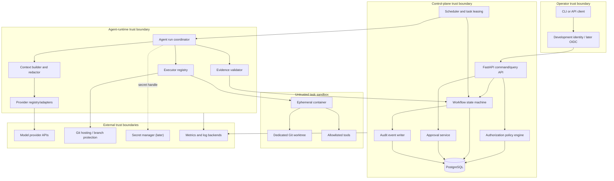
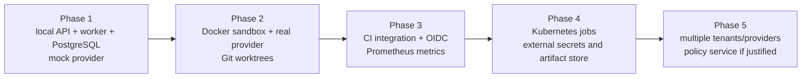

# System Architecture

## Scope and assumptions

Phase 0 defines a control plane, not an autonomous production operator. The initial system coordinates one workflow type in one trusted administrative domain. It assumes a human-controlled Git service enforces protected branches and that container execution is available before untrusted repository content is executed.

Several assumptions in the original concept need qualification:

- **A role name is not a security boundary.** Enforcement must use authenticated identities, capability grants, task scope, and an out-of-process execution sandbox.
- **A Git worktree prevents file collisions, not malicious host access.** It must be paired with container or VM isolation before arbitrary commands run.
- **An append-only application table is not tamper-proof.** The MVP makes events immutable through application permissions and hash chaining; stronger external/WORM retention is a later control.
- **Multiple model reviews do not create independence if they share prompts, data, or failure modes.** Review context must be deliberately separated, and deterministic evidence remains authoritative.
- **One human approval cannot safely cover both merge and production deployment.** Approval records must be action-scoped, target-scoped, revision-bound, and expiring.
- **Supporting a provider does not imply equivalent capabilities or safety.** Provider selection must be capability- and policy-based, with explicit data-egress classification.

## Architectural style

Use a modular monolith for the MVP. It provides clear internal boundaries without adding distributed deployment failure modes before they are needed. The same Python package exposes two processes:

- **API:** authentication boundary, command validation, reads, approval submission, and operator controls.
- **Worker:** durable task leasing, orchestration, provider invocation, isolated execution, retry handling, and evidence collection.

PostgreSQL provides transactions, constraints, task leasing, state, and audit storage. A database-backed queue avoids an early Redis dependency and preserves the relationship between state transitions and emitted events in one transaction.

The current `ControlPlaneService` is a transitional application facade and has accumulated workflow,
evaluation, Git, deployment, and recovery orchestration. Phase 5.3A moved human-controlled
evaluation repair, interrupted-assessment recovery, and winner promotion into a composed
`EvaluationLifecycleService`. Phase 5.3B moves committed provider execution, ambiguity
reconciliation, deterministic validation, independent review, and assessment submission into a
composed `EvaluationPipelineService`. The façade contract remains stable, and the remaining campaign,
workflow, Git, deployment, and integration responsibilities still require tested domain boundaries
before production. These are internal modular-monolith refactors, not justification for network
services or new infrastructure.

## Component model

## Component responsibilities

| Component | Responsibility | Must not do |
|---|---|---|
| API | Validate commands, authenticate callers, expose status and evidence | Execute model-generated commands |
| Policy engine | Decide whether an actor may perform an action on a scoped resource | Infer permission from a prompt or role label alone |
| Workflow engine | Enforce legal transitions and stage completion predicates | Accept arbitrary next-state values |
| Scheduler | Lease ready tasks, enforce concurrency and retry policies | Hold correctness-critical state only in memory |
| Approval service | Record scoped human decisions and verify binding to revision/target | Accept agent principals as human approvers |
| Context builder | Select, label, minimize, and redact provider context | Send an entire repository or secret by default |
| Provider adapter | Normalize provider requests, capabilities, responses, usage, and errors | Grant tools or filesystem access |
| Executor | Create the sandbox, mount a task worktree, enforce limits, collect artifacts | Mount the host socket or broad host paths |
| Evidence validator | Verify result schemas, test reports, hashes, and expected artifacts | Treat prose assertions as test evidence |
| Audit writer | Persist structured, append-only security and workflow events | Store raw secrets or unrestricted prompt content |

## Control flow

1. A human submits a workflow command through the API.
2. Authentication identifies the principal; authorization checks action, resource, environment, and current state.
3. The workflow engine commits the new state, queued task, and audit event atomically.
4. A worker obtains a time-limited task lease using a database transaction.
5. The runtime builds minimal context and selects a provider by required capability and allowed data-egress policy.
6. If execution is needed, the executor creates a dedicated worktree and ephemeral sandbox with a task-scoped capability manifest.
7. Results and artifacts are validated. Their digests and summaries are recorded before the workflow can advance.
8. At privileged boundaries, the workflow stops until a human submits a scoped approval for the exact action and revision.

## API boundaries

The MVP API should be command-oriented where state changes matter. It should not expose a generic endpoint that lets clients set state.

| Method and route | Purpose | Principal |
|---|---|---|
| `POST /workflows` | Submit an engineering request | Human operator |
| `GET /workflows/{id}` | Read state, tasks, gates, and evidence | Authorized human/auditor |
| `POST /workflows/{id}/cancel` | Request cancellation | Owner/operator |
| `POST /tasks/{id}/retry` | Manual retry after policy check | Operator |
| `GET /tasks/{id}` | Read assignment, attempts, and evidence | Authorized human/auditor |
| `POST /approvals` | Approve/reject one action, target, and revision | Eligible human approver |
| `GET /events` | Filter audit events | Auditor/operator |
| `GET /health/live` | Process liveness | Platform |
| `GET /health/ready` | Database and worker readiness | Platform |
| `GET /metrics` | Prometheus exposition, when enabled | Monitoring identity |
| `POST /mcp` | Claim an explicit implementation task, heartbeat it, or return Git-bound evidence | Local Windsurf integration identity |

The MCP surface is a separately authenticated process and exposes only three typed tools, not the control API. Agent/provider callbacks, if later required, belong on a separately authenticated route group and must be idempotent. They cannot directly transition workflows.

## Data ownership and consistency

- Git owns code, configuration, tests, infrastructure definitions, and approved documentation.
- PostgreSQL owns workflow state, task/run state, policy snapshots, leases, approvals, artifact metadata, and audit events.
- Object storage may later own large artifacts; the database stores hashes, metadata, classification, and retention references.
- State changes use optimistic version checks plus database constraints. Commands include idempotency keys.
- A transition, its tasks, and its audit/outbox event are committed in one transaction.

## Deployment evolution

Extraction into separate services is justified only by measured scaling, fault-isolation, ownership, or compliance needs. Interfaces should be kept explicit now, but network boundaries should not be invented prematurely.
