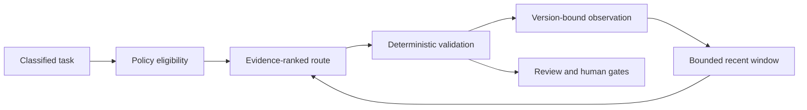

# Controlled Continuous Improvement

## Operating principle

Continuous improvement means learning which eligible provider performs best for a specific capability under verified conditions. It does not mean letting a model rewrite its own permissions, prompts, policies, tests, routing history, or approval requirements.

The worker now records one append-only provider observation for each routed attempt. The observation is derived from control-plane execution and validation, not from a provider's opinion of its own answer. It includes the provider identity and family, exact model version, profile version, task capability, success, validation result, latency, error class, workflow, task, and attempt.

## Feedback loop

The loop operates under these controls:

- policy filters execute before scoring and cannot be relaxed by evidence;
- observations are partitioned by provider ID, model version, profile version, and capability;
- only the most recent configured observation window affects routing;
- small samples are pulled toward a neutral prior;
- high-risk routes require a configurable minimum evidence count;
- a new model or profile version begins unqualified instead of inheriting old trust;
- routing failures produce a blocked workflow rather than an unapproved fallback; and
- every routing decision stores candidates, scores, exclusions, policy version, and the selected identity.

Eligible candidates are ranked under one operator-selected, versioned objective: `BALANCED`,
`QUALITY`, `SPEED`, or `FRUGAL`. The objective only reweights bounded quality, cost, and latency
utilities after every policy filter has run. Each component is retained in the routing record so
the choice is explainable. Set `CONTROL_PLANE_ROUTING_OBJECTIVE`; the default is `BALANCED`.

## Configuration

| Setting | Default | Purpose |
|---|---:|---|
| `CONTROL_PLANE_EVIDENCE_WINDOW_SIZE` | 100 | Limits how much recent version-specific history influences a route |
| `CONTROL_PLANE_HIGH_RISK_MIN_EVIDENCE_SAMPLES` | 20 | Prevents unproven providers from receiving high-risk work |
| `CONTROL_PLANE_ROUTING_OBJECTIVE` | `BALANCED` | Chooses transparent ranking weights without changing eligibility |

The external egress allowlist is an explicit, versioned runtime policy input and defaults to local-only. A credential never activates Claude, Devin, Windsurf, or another external provider by itself; activation also requires an enabled binding, scoped credential reference, health, allowed data class and risk, and operator-approved egress. Routing records preserve the activation-policy version alongside the routing-policy version.

## Qualification and promotion

New provider and model versions should first run against deterministic evaluation fixtures or low-risk work. Promotion to normal routing should require enough representative observations, acceptable security and validation results, cost and latency review, and explicit operator approval. High-risk eligibility follows only after the configured evidence floor is met for the exact required capability.

The current implementation learns from real routed attempts. A later evaluation service should add signed benchmark observations, holdout suites, regression thresholds, drift alerts, and automatic demotion. Automatic promotion is intentionally excluded: evidence may recommend promotion, but an authorized human changes the provider's enabled scope.

## Evidence quality and poisoning resistance

Direct task success is useful but incomplete. Later phases should correlate producer performance with downstream test failures, security findings, review reversals, rollbacks, and escaped defects. These delayed outcomes must be attributed carefully so a provider is not rewarded for merely producing schema-valid output.

Provider-generated scores, hidden chain-of-thought, free-form self-critiques, and model agreement are not routing evidence. Evaluation fixtures and policy changes must be versioned and reviewable. Suspicious repositories remain contained so they cannot poison prompts, validators, or the evidence pipeline.

## Deployment-cost review

At each Phase 4 exit review, compare the approved local profile with current open-source,
managed-cloud, free-tier, and short-lived hosting options. Promote an alternative only when it
reduces total cost or operational risk without weakening identity, approval, audit, backup,
verification, or recovery controls. Pricing claims require current provider evidence. A cheaper
headline price alone is not sufficient, and no monitoring result authorizes account creation,
spend, or deployment.

## Visibility

Authorized auditors can inspect:

- `GET /routing-decisions?workflow_id=...` for replayable decisions; and
- `GET /provider-evidence` for current version- and capability-specific aggregates.

Normal records exclude prompt bodies and credentials. Sensitive debugging artifacts require separate retention and access policy.
