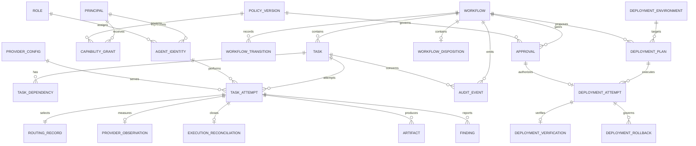

# Proposed Data Model

The relational model keeps authorization and transition-critical fields explicit while allowing versioned JSON metadata for provider-specific details. Identifiers use UUIDs. Mutable records carry creation/update timestamps and, where concurrency matters, a monotonic version.

## Core entities

| Entity | Important fields and constraints | Purpose |
|---|---|---|
| `principal` | `id`, `type`, `external_subject`, `status`; unique identity mapping | Authenticated human/service/agent/integration subject |
| `role` | `id`, `name`, versioned baseline capabilities | Separation-of-duties category, not sufficient authorization alone |
| `agent_identity` | `id`, `principal_id`, `role_id`, logical name, status | Stable logical agent independent of provider/model |
| `capability_grant` | principal, workflow/task, repo/revision, paths, tools, network, limits, policy, expiry; immutable | Narrows role authority to one assignment context |
| `workflow` | `id`, type, state, version, requester, risk class, policy version, timestamps | Durable orchestration aggregate |
| `workflow_disposition` | workflow, human actor, original signals, decision, rationale, timestamp; unique workflow | Human-only release or rejection of input containment |
| `execution_reconciliation` | workflow, task, unique attempt, human actor, retry/fail decision, rationale, timestamp | Immutable disposition of an expired running attempt with unknown external outcome |
| `workflow_transition` | workflow, sequence, from/to, command, actor, evidence set, timestamp; unique sequence | Human-readable transition ledger and concurrency evidence |
| `task` | workflow, role, objective, status, priority, requirements, expected outputs, retry policy | Schedulable unit of work |
| `task_dependency` | task, prerequisite task; unique pair; cycle prohibited | Explicit DAG relationship |
| `task_attempt` | task, attempt number, agent, provider, lease token/owner/expiry, status, timestamps, error class, usage | Immutable execution history except controlled lifecycle fields |
| `provider_config` | adapter type, capability descriptor, data class, status, secret reference | Policy-visible provider registration without credentials |
| `routing_record` | task/attempt, policy version, request constraints, ranked candidates, rejection reasons, selected provider/model | Replayable fail-closed provider decision |
| `provider_observation` | task/attempt, provider/family, model/profile version, capability, success, validation, latency, error | Version-specific evidence for controlled routing improvement |
| `evaluation_observation` | assessment/provider run/campaign, provider/family, model/profile version, capability, success, validation, selection, latency, error | Replay-safe routing evidence from trusted evaluation decisions |
| `evaluation_review_run` | assessment/artifact/candidate run, reviewer identity/family/model/profile, request and evidence digests, reviewed digest, status, result, usage, latency | Durable independent judgment over an exact candidate artifact |
| `evaluation_reconciliation` | workflow/campaign, target type/ID, human actor, decision, rationale, affected runs | Immutable fail-closed disposition for ambiguous evaluation calls |
| `artifact` | attempt, type, URI/reference, digest, size, media type, classification, revision | Validated output/evidence metadata |
| `finding` | attempt, category, severity, status, evidence, affected digest, disposition | Review/security issue tracked to closure |
| `approval` | workflow, action, target, revision/digest, policy, human principal, decision, rationale, expiry, consumed time; immutable | Scoped human authorization; unique active approval rules |
| `deployment_environment` | immutable ID, classification, provider/account/region scopes, adapter and policy versions, repository/branch, requirements, verification and rollback policies, active state | Operator-owned allowlist; repository or model content cannot widen it |
| `deployment_plan` | workflow, environment, confirmed merge revision, artifact digests, typed operations, impact, probes, rollback reference, policy, canonical digest | Immutable content-addressed deployment proposal |
| `deployment_attempt` | plan, exact approval, actor/idempotency key, adapter, status, operation reference, sanitized result, timestamps | Durable execution intent and outcome without credential material |
| `deployment_verification` | unique attempt, pass/fail, observed revision, structured evidence | Independent post-execution result binding |
| `deployment_rollback` | attempt, human decision, rationale, evidence | Durable recovery decision record for later recovery slices |
| `audit_event` | global ID, workflow sequence, prior hash, body hash, actor/action/resource/outcome, correlations, schema version | Append-only security and operational record |
| `policy_version` | ID, digest, effective time, status, source revision | Binds decisions and evidence to the policy used |
| `idempotency_record` | principal, endpoint/command, key, request digest, response reference, expiry | Prevents duplicate commands from retries |
| `outbox_event` | aggregate, event type, payload, created/published time, attempt count | Reliable later delivery to telemetry/integrations |

Large prompt/output bodies are not required in the core database. If retained for an explicit debugging or evidence purpose, store them as classified artifacts with access and retention controls; normal audit records hold their digest and sanitized summary.

## Invariants

- One task attempt number is unique within a task.
- One capability grant is unique per principal and task; switching execution identities deactivates prior grants instead of widening them.
- One worker may own an active lease; lease actions require the matching unguessable token.
- A workflow transition sequence is unique and monotonically increasing.
- A transition's `from_state` must match the locked workflow state/version.
- An approval actor must be a currently eligible human principal and cannot be an agent principal.
- Approval consumption requires exact action, target, policy version, and revision/digest match before expiry.
- Evidence required for a gate must refer to the candidate revision being advanced.
- One routing record exists per routed attempt; a blocked decision has no selected provider.
- At most one direct provider observation exists per attempt, and model/profile versions never share evidence implicitly.
- One independent review run exists per candidate artifact and reviewer provider; its reviewed digest cannot be replaced by provider prose.
- One evaluation reconciliation exists per ambiguous target, and the only current disposition is to mark unknown runs failed without replay.
- A workflow input disposition is unique, preserves the original signals, and cannot release another block type.
- An expired running attempt permits at most one human execution reconciliation; retry creates a new task instead of reopening the abandoned attempt.
- Audit events are inserted, never updated or deleted by application roles.
- Task dependencies must belong to the same workflow in the MVP and may not form a cycle.

## Transaction boundaries

Creating a workflow commits the workflow, initial tasks, idempotency response, and audit events together. Advancing a state locks the workflow and commits the transition, new ready tasks, approval consumption, and audit event together. Execution uses three boundaries: prepare and commit the `RUNNING` attempt; invoke provider and executor outside a database transaction while independent heartbeat transactions renew the lease; then lock and finalize only if the same lease remains authoritative. Expiry and human reconciliation are separate audited transactions.

## Retention and deletion

Retention is policy driven. Deleting a repository or user-facing workflow does not silently erase security evidence. Personal or sensitive content should be minimized so audit retention remains defensible. Later archival can move old artifacts while preserving digest, classification, legal hold, and chain metadata.
