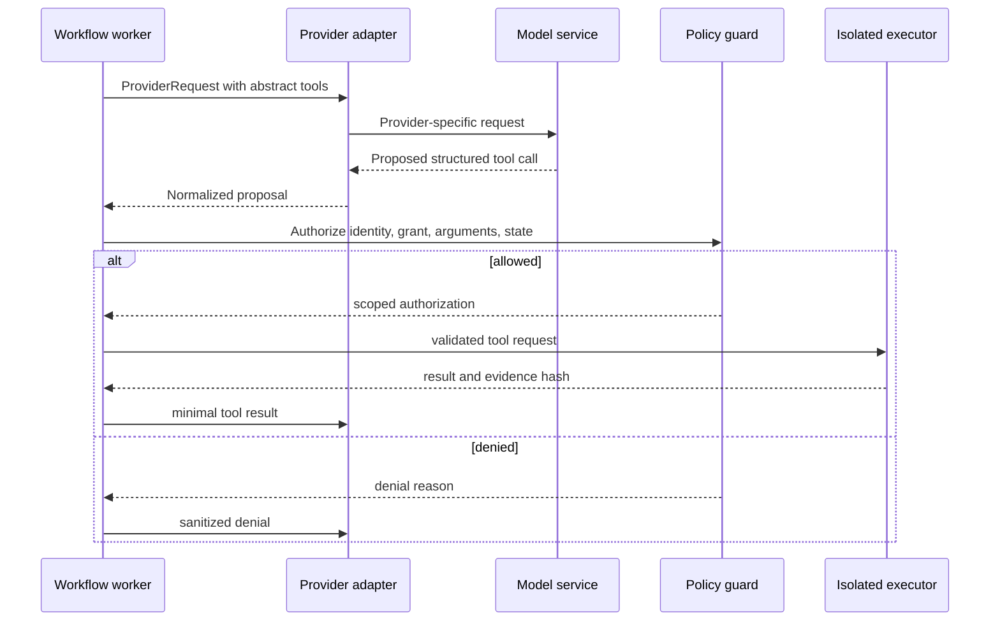

# Provider Abstraction

## Objective

The provider boundary allows the orchestrator to request a capability without assuming that every model can use tools, edit repositories, stream output, or run asynchronously. Provider adapters translate; they do not enforce workflow policy or grant execution privileges.

## Core concepts

### Capability descriptor

An adapter declares normalized capabilities and constraints, including:

- `reasoning`, `code_generation`, `review`, `structured_output`, `tool_requests`, and `long_running`;
- supported input/output modalities and maximum context/output limits;
- synchronous, streaming, polling, or callback execution mode;
- data residency/egress classification and provider retention settings;
- supported tool-call semantics;
- cancellation and idempotency behavior; and
- usage/latency fields the adapter can report.

Capability claims are configuration and must be validated by conformance tests. The scheduler matches task requirements and policy to an eligible provider. A provider name is never used as a proxy for security.

### Provider request

A normalized request contains:

- run and idempotency IDs;
- logical agent identity and assigned role;
- system instruction version;
- minimal context items with provenance, classification, and content digests;
- required output schema;
- requested capabilities;
- allowed abstract tools, if any;
- timeout, token, and cost budgets; and
- tracing metadata that contains no secret.

The request does not contain raw platform credentials or authority to change workflow state.

### Provider result

A normalized result contains:

- provider request/run IDs and terminal status;
- validated structured output or validation error;
- proposed tool calls, never pre-authorized tool execution;
- provider/model/version metadata;
- usage, latency, finish reason, and safety metadata when available;
- artifact references and hashes; and
- a normalized error with retry classification.

## Conceptual interface

The exact Python syntax belongs to Phase 1, but the contract is:

```text
ModelProvider
  describe_capabilities() -> CapabilityDescriptor
  submit(ProviderRequest) -> ProviderHandle | ProviderResult
  poll(ProviderHandle) -> ProviderResult
  cancel(ProviderHandle) -> CancellationResult
  health() -> ProviderHealth
```

Optional operations are advertised, not assumed. A synchronous provider can return a result immediately; a long-running provider returns a handle. Unsupported operations fail explicitly rather than silently degrading.

## Tool-use boundary



The adapter never executes a proposed shell command directly. The control plane parses the tool schema, checks it against the task grant, and sends an approved operation to the sandbox. Commands should use executable-plus-argument arrays and a controlled working directory; shell interpolation is disabled unless an explicitly approved tool requires it.

## Initial adapters

1. **MockProvider:** deterministic fixtures for plans, reviews, failures, timeouts, malformed output, and usage data. It remains the active default.
2. **AnthropicProvider:** disabled-by-default Claude Messages adapter with an official-endpoint restriction, opaque secret reference, structured JSON parsing, normalized usage, and client-side tool proposals. Activation still requires an approved data-egress and cost policy.
3. **DevinRuntime:** modeled separately as a remote session runtime with create, poll, and cancel lifecycle operations, service-user credentials, repository scope, cost-unit limits, and no approval-bypass field.
4. **Windsurf handoff:** Git- and MCP-oriented interoperability because the documented Enterprise API does not establish a general headless Cascade-session interface.
5. **LocalModelProvider:** later adapter for Ollama-compatible local inference. Local execution reduces some data-egress risk but does not make model output trusted.

Remote agents and IDE systems are not forced into a chat-completion-shaped interface. Their workspace, cost, identity, approval, and lifecycle differences remain visible to the orchestrator.

## Error taxonomy and retry

| Error | Automatic retry? | Response |
|---|---:|---|
| Rate limit / transient provider outage | Bounded | Backoff with jitter; respect retry hints |
| Timeout before accepted handle | Bounded if idempotency supported | Retry same idempotency key |
| Unknown status after remote acceptance | No blind retry | Poll/reconcile; require operator if ambiguous |
| Invalid structured output | At most one repair attempt by policy | Record original validation failure |
| Authentication/authorization | No | Disable route; alert operator |
| Policy/data-classification violation | No | Deny before send; audit security event |
| Context limit exceeded | No blind truncation | Rebuild context using declared selection policy |
| Budget exceeded | No | Cancel if possible; mark blocked/failed by policy |

Fallback to another provider is an explicit policy decision. It may change data residency, capability, quality, and cost, so adapters cannot perform hidden fallback.

## Conformance testing

Every adapter runs the same contract suite for capability reporting, schema validation, idempotency, timeout behavior, cancellation, error mapping, usage reporting, secret redaction, and unsupported operations. Recorded fixtures should be sanitized and versioned. Live-provider tests remain opt-in to avoid nondeterminism and cost in the default test suite.
