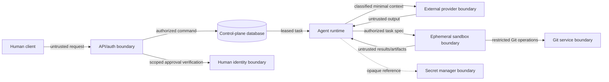

# Threat Model

## Method and security objectives

This threat model uses STRIDE as a coverage aid and prioritizes controls by impact and reachable trust boundary. It covers the MVP control plane, agent runtime, task sandboxes, PostgreSQL, Git integration, human API, and model providers.

Security objectives are:

1. prevent agents from gaining authority beyond their assignment;
2. prevent unreviewed or unapproved changes from reaching protected branches or production;
3. preserve the integrity and traceability of workflow state, evidence, and approvals;
4. minimize code, secret, and sensitive-context disclosure;
5. contain malicious or erroneous commands and artifacts; and
6. recover predictably from partial, duplicated, or unavailable operations.

## Assets

- source code, infrastructure code, and Git history;
- production environments and deployment credentials;
- provider, Git, database, and platform credentials;
- workflow/task state, policies, approvals, evidence, and audit history;
- proprietary prompts, repository context, and model outputs;
- worker capacity, provider budgets, and availability; and
- human identity and approval authority.

## Trust boundaries and data flows

Everything entering from a human client, repository, provider, sandbox, integration callback, or dependency ecosystem is untrusted until authenticated, authorized, parsed, and validated for its intended use.

## Threat actors

- a compromised or malicious model/provider;
- prompt-injected repository content or dependency;
- an agent that hallucinates or exceeds instructions;
- an external attacker with API or supply-chain access;
- a malicious or mistaken authorized human;
- a compromised worker, sandbox image, CI job, or Git integration; and
- accidental concurrency, retry, or configuration faults that behave like attacks.

## Threat register

| ID | Threat | STRIDE | Initial risk | MVP controls | Residual risk / later work |
|---|---|---|---|---|---|
| T01 | Repository text instructs an agent to reveal secrets or bypass policy | S/T/I/E | Critical | Treat content as data; provenance labels; no secret in context; typed tools; external authorization | Injection remains possible in reasoning; add content scanning and stronger taint tracking |
| T02 | Model proposes command injection or destructive shell arguments | T/E | Critical | Structured tools; argument validation; deny shell by default; sandbox; path scope; approval for destructive actions | Tool/parser bugs; fuzz schemas and use OS isolation |
| T03 | Agent approves its own work or fabricates human approval | S/E/R | Critical | Principal types; SoD policy; signed/authenticated human API; scoped approval table; immutable events | Compromised human account; add MFA/OIDC assurance and dual control for highest risk |
| T04 | Sandbox escapes to host/control plane | E/T/I | Critical | Non-root ephemeral container; no runtime socket; minimal mounts; dropped capabilities; resource limits; patched images | Containers share a kernel; consider microVMs for hostile workloads |
| T05 | Secret leaks in prompt, log, exception, artifact, or Git diff | I | Critical | Opaque refs; just-in-time resolution; redaction; egress policy; secret scanning; no raw payload logs | Pattern scanning misses novel secrets; external provider retention must be reviewed |
| T06 | Agent or worker pushes/merges directly to protected branch | T/E | Critical | No merge credential in sandbox; Git branch protection; scoped integration token; human approval; verify merge callback | Git administrator misconfiguration; continuously test protection settings |
| T07 | Malicious dependency executes during install/build/test | T/E/I | High | Network denied by default; locked dependencies; isolated build; allowlisted registries; SBOM/scanning later | Package maintainer compromise; add provenance/signature policy and staged mirrors |
| T08 | Audit records are altered or selectively omitted | T/R | High | Insert-only application role; transactionally written events; sequence and hash chain; backups | DB admin can tamper; later export to external immutable storage/signing |
| T09 | Duplicate retry repeats a non-idempotent external action | T/D | High | Idempotency keys; operation classification; reconciliation; no blind retry after ambiguous acceptance | Third-party APIs may lack idempotency; require operator decision |
| T10 | Stale lease or race advances a workflow twice/out of order | T/D | High | Row locks; lease tokens/expiry; optimistic workflow version; unique constraints; atomic transition/event | Database/operator faults; property and concurrency testing |
| T11 | Provider fallback sends classified code to an unapproved destination | I | High | Provider data-classification policy; no implicit fallback; audit destination and digest | Misclassification; add repository-level egress labels and DLP controls |
| T12 | Untrusted artifact exploits parser/viewer in control plane | T/E | High | Content-type/size limits; store outside web root; parse in sandbox; hash; never execute on import | Parser vulnerabilities; keep parsers patched and isolate preview service |
| T13 | Cost/token or task fan-out exhaustion | D | Medium/High | Per-run/workflow/provider budgets; concurrency limits; bounded retries; cancellation; alerts | Distributed abuse; later tenant quotas and billing controls |
| T14 | Worker/provider outage strands workflows | D | Medium | Durable state; leases; readiness; retry classes; reconciliation and manual recovery | Regional/DB outage; later backups, HA, and recovery exercises |
| T15 | Security agent changes baseline to pass its own review | T/E/R | High | Policy stored/versioned separately; security role read-only; exceptions human-scoped and expiring | Authorized policy-owner abuse; require review/dual control later |
| T16 | Context poisoning causes unsupported architectural consensus | T | Medium | Independent context; structured findings; evidence disposition; deterministic gates; human review | Correlated models remain; vary evaluation methods for high risk |

## Approval security

An approval record binds the approver to an action type, workflow, repository, exact revision/artifact digest, target environment, policy version, decision, rationale, creation time, and expiry. Any revision, target, or material policy change invalidates the approval. The approval service rechecks eligibility at use time.

The control plane should not possess an unrestricted production credential merely because an approval exists. A deployment platform should independently verify the approval claim and environment policy, or require a separate human action. This preserves defense in depth if the control plane is compromised.

## Audit integrity and privacy

Events use a per-workflow sequence, previous-event hash, canonical event body hash, actor, action, resource, outcome, policy version, timestamp, and correlation IDs. The event stream is append-only to application roles. Corrections are new events.

Do not log full prompts, model chain-of-thought, secret values, arbitrary command environment variables, or complete source files by default. Store hashes, classifications, selected metadata, sanitized summaries, and protected artifact references. Auditability does not justify indiscriminate sensitive-data collection.

## Security verification priorities

Before any real provider or command executor is enabled, verify transition invariants, SoD denials, path traversal defenses, argument handling, log redaction, lease races, and approval invalidation. Before a real Git merge integration, verify branch protection independently. Before deployment integration, perform a separate threat-model review and require an environment-specific approval design.
