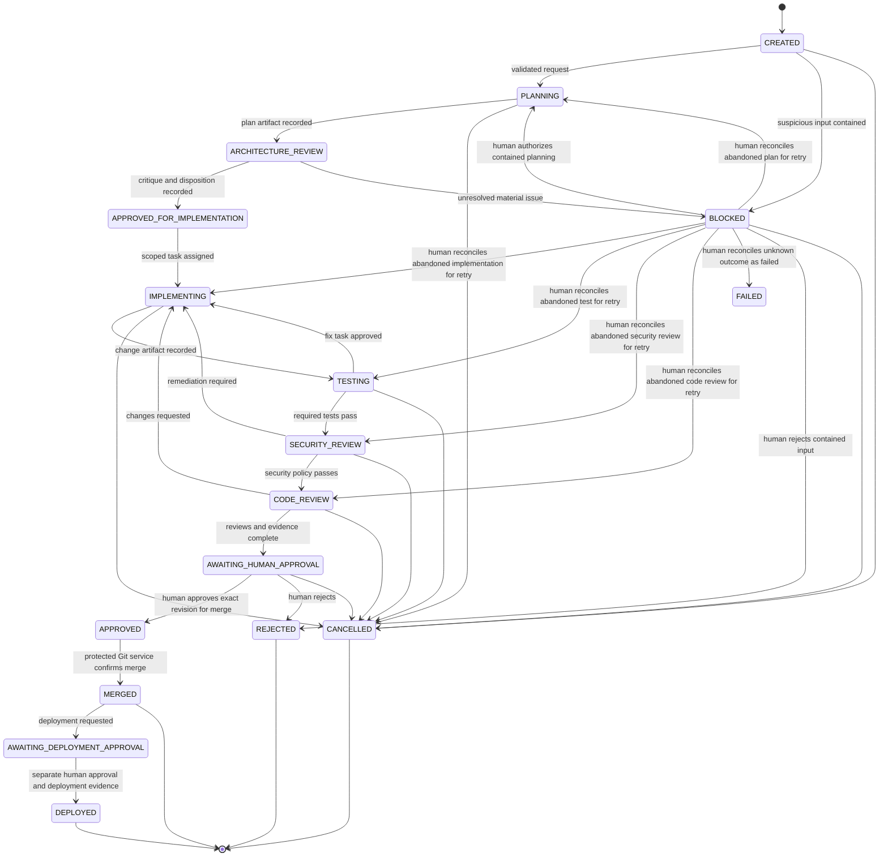

# Workflow and State Machine

## Design rule

The workflow engine owns state. Agents produce typed proposals and evidence; they do not choose the next state. A transition occurs only when the current state, actor permission, stage predicates, policy version, and required evidence all validate.

## Primary workflow

`FAILED` and `ROLLBACK_REQUIRED` are exceptional states omitted from the main diagram for readability. A non-retryable failure from any active execution stage enters `FAILED`. A deployment that completes but fails verification enters `ROLLBACK_REQUIRED`, never directly `FAILED`, because the system may already have changed.

Phase 4.1 exercises this boundary with a no-credential dry-run adapter. A successful simulation
records an attempt and verification but remains in `AWAITING_DEPLOYMENT_APPROVAL`; only a later
approved adapter that can prove an actual target revision and health may enter `DEPLOYED`.

## State predicates

| Target state | Required predicates |
|---|---|
| `PLANNING` | Request schema valid; requester authorized |
| `ARCHITECTURE_REVIEW` | Plan artifact exists; planner run completed |
| `APPROVED_FOR_IMPLEMENTATION` | Independent critique exists; every material finding is accepted, mitigated, rejected with rationale, or escalated; policy permits risk |
| `IMPLEMENTING` | Task scope, agent grant, repository, base revision, and executor policy fixed |
| `TESTING` | Change artifact and immutable revision digest exist |
| `SECURITY_REVIEW` | Required deterministic tests passed for that digest |
| `CODE_REVIEW` | Required security checks passed or an eligible human recorded a time-bound exception |
| `AWAITING_HUMAN_APPROVAL` | Code review complete; all evidence binds to the same revision; no open blocking finding |
| `APPROVED` | Eligible human approved `MERGE` for exact repository, branch/revision, workflow, and expiry window |
| `MERGED` | Git provider independently confirms protected-branch merge commit |
| `DEPLOYED` | Separate `DEPLOY` approval, environment authorization, successful deployment record, and post-deploy verification |

Suspicious or adversarial input enters `BLOCKED` before any task is scheduled. Only a human principal with `DISPOSITION_WORKFLOW` may either reject it or resume local contained planning with a rationale. This command cannot release a block caused by provider qualification, policy, or missing capability, so disposition is not a general-purpose bypass.

## Transition enforcement

Transitions are registered in code as an allowlist and duplicated as invariant-focused tests. The database stores the current state and a monotonic version. The engine performs a compare-and-swap update in the same transaction as the resulting event and newly ready tasks. The API accepts commands such as `approve_merge`, never a client-supplied `next_state`.

Forbidden examples include:

- `IMPLEMENTING -> DEPLOYED`;
- `TESTING -> APPROVED`;
- `AWAITING_HUMAN_APPROVAL -> MERGED` without a revision-bound approval;
- an `IMPLEMENTER` principal creating an approval for its own workflow;
- reusing an approval after the approved revision changes; and
- a worker advancing a task whose lease is expired or owned by another worker.
- a deployment using an approval for another environment, revision, plan digest, or policy;
- an expired or already consumed deployment approval; and
- a production target or credential-requiring adapter during Phase 4.1.

## Tasks, attempts, and runs

A workflow contains ordered or dependent tasks. A task expresses an objective, role, required capabilities, inputs, expected outputs, evidence policy, and retry policy. Each execution creates an immutable attempt/run record. Retrying does not overwrite the failed attempt.

Task status is separate from workflow state:

`PENDING -> READY -> LEASED -> RUNNING -> SUCCEEDED | FAILED | TIMED_OUT | BLOCKED | CANCELLED`, with `BLOCKED -> RECONCILED` when a human closes an abandoned execution record.

A lease has an owner, token, expiration, and heartbeat. Provider and executor calls occur after `RUNNING` state commits and outside database transactions. Heartbeats renew the lease in independent transactions. Successful or failed evidence is accepted only while the same running lease remains active; late results are rejected. A pre-execution `LEASED` expiry may return to `READY`, while a `RUNNING` expiry always blocks for explicit human reconciliation because its external outcome may be unknown.

## Review independence

The architecture reviewer receives the requirements, proposed plan, declared assumptions, and evaluation rubric, but not the planner's hidden reasoning or a prompt encouraging agreement. Its required output is a structured finding list with severity, evidence, affected assumption, and suggested verification.

A deterministic disposition check confirms that all blocking findings have an explicit outcome. A third model may help summarize disputes, but it cannot override tests, policy, or a human risk decision.

## Cancellation, failure, and recovery

- Cancellation is cooperative first, then sandbox termination after a grace period.
- A cancelled or timed-out run cannot publish new authoritative evidence.
- Retryable errors use bounded exponential backoff with jitter and a maximum attempt count.
- Validation, authorization, policy, and unsafe-output failures are not automatically retried.
- Recovery commands are explicit, authorized, idempotent, and audited.
- Deployment failures preserve the last known state and open a rollback decision; the control plane does not guess that rollback is safe.
